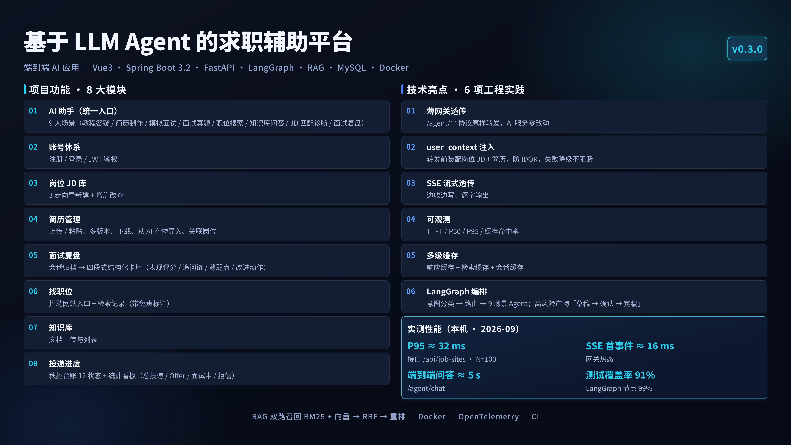
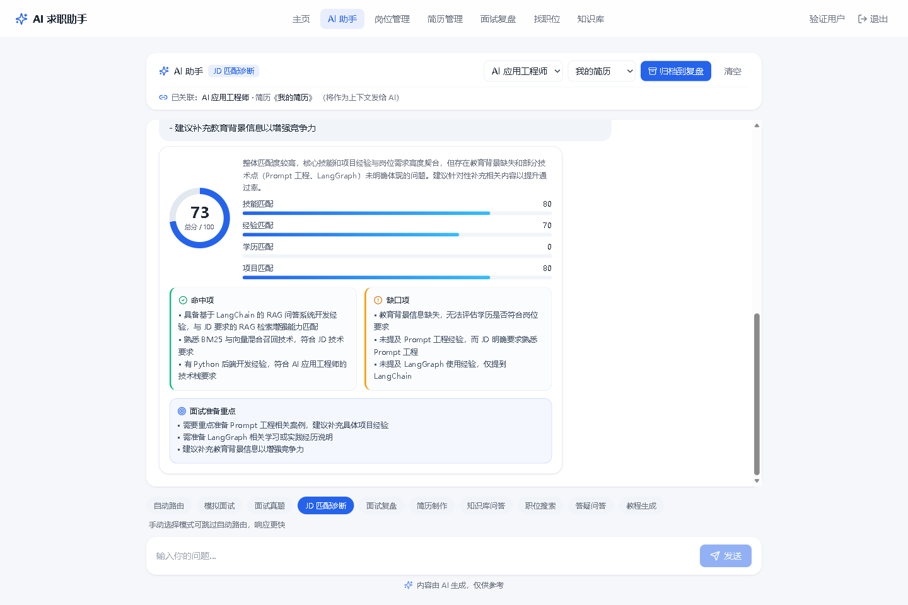
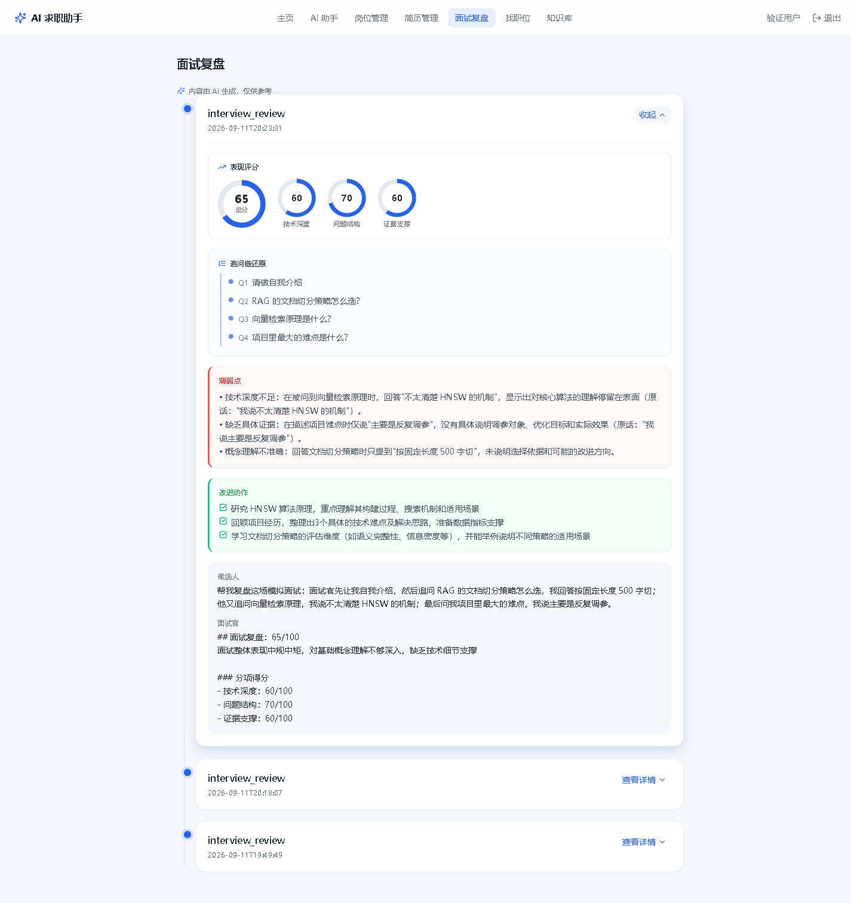
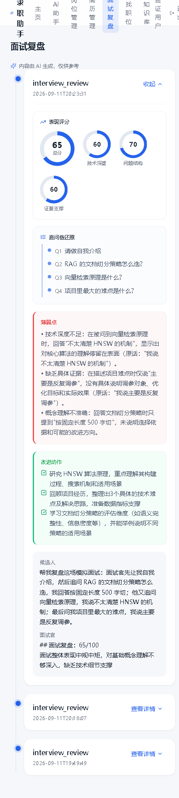
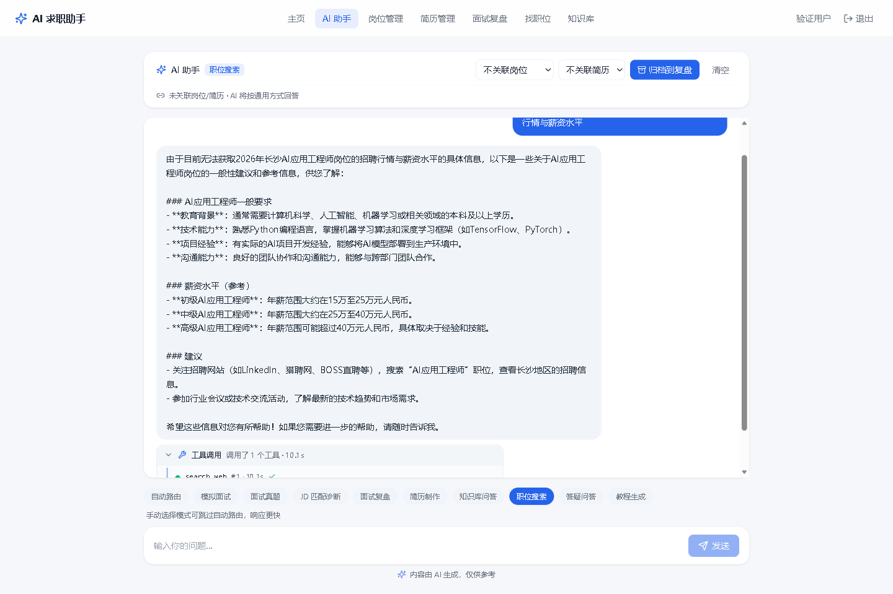

# GenAI Career Assistant · RAG + Agent 职业引擎

> 当前版本 **v1.6.0** · 变更记录见 [§十](#十版本与变更记录)



一个**可运行、可演示、可度量**的 GenAI 职业助手工程：左边是「LangGraph 多 Agent 职业助手」（教程 / 答疑 / 简历 / 面试题 / 模拟面试 / 职位搜索 / **JD 匹配诊断** / **面试复盘**），右边是「企业知识库 RAG 引擎」（上传文档 → 混合检索 → 重排 → 带引用问答）。对外同时提供 **Streamlit 演示界面**与 **FastAPI 服务接口**，并内置 **效果评测体系**（Recall@5 / MRR / 命中率 / 幻觉率 + A-B 对比报告），以及**显式检索 vs Function Calling 双路径 A/B**。

> 目标：一个**可运行、可演示、可度量**的工程化作品——每个能力都有对应的指标、开关与失败路径处理，而不是只跑通一次的 Demo。

---

## 一、功能一览（9 个场景）

| # | 功能 | 模式 | 说明 |
|---|------|------|------|
| 1 | 教程生成 | `tutorial` | 联网检索后生成结构化 Markdown 教程（概念 + 可运行代码 + 参考链接） |
| 2 | 答疑问答 | `qa` | 资深 GenAI 工程师人设，多轮答疑，结束导出答疑记录 |
| 3 | 简历制作 | `resume` | 分步收集信息生成简历，支持基于 JD 改写 |
| 4 | 面试真题 | `interview_questions` | 检索整理目标岗位面试题清单 + 答案要点 |
| 5 | 模拟面试 | `mock_interview` | 面试官一问一答，结束输出结构化评价与改进建议 |
| 6 | 职位搜索 | `job_search` | 按城市 + 岗位关键词检索，整理为 Markdown 职位清单 |
| 7 | 知识库问答 | `knowledge` | 上传 PDF/Word/MD/HTML/TXT → 混合检索 + 重排 + 带引用问答 |
| 8 | JD 匹配诊断 | `jd_match` | 结合已关联的岗位 JD 与简历，结构化产出总分 / 分项得分 / 命中项 / 缺口项 / 面试准备重点 |
| 9 | 面试复盘 | `interview_review` | 把已结束的面试还原为表现评分 / 追问链 / 薄弱点 / 改进动作，归档后在前端分区卡片展示 |

输入一句话会自动路由到对应模式，也可在侧边栏手动强制切换。支持通过 `user_context` 注入用户画像（由 jobseeker 薄网关传入岗位 JD + 关联简历），使 9 个场景直接结合用户背景作答。

### 界面速览：JD 匹配诊断与面试复盘

**JD 匹配诊断评分卡**（`jd_match` 模式）：结合已关联的岗位 JD 与简历，一次结构化产出**总分 / 分项得分 / 命中项 / 缺口项 / 面试准备重点**，每一项都落到具体证据上，而不是给一句「匹配度还不错」。真机实测返回 **73/100**（技能 80 / 经验 70 / 学历 0 / 项目 80），前端渲染为环形总分 + 分项进度条 + 命中 / 缺口双栏：



**面试复盘分区卡片**（`interview_review` 模式）：把已结束的面试归档为**表现评分 / 追问链 / 薄弱点 / 改进动作**四段式卡片。左图是宽屏布局，右图是同一界面在**窄屏（415px）**下的效果——四段卡片由横向排布自动**堆叠为纵向**，文字不裁切、不出现横向滚动条：

<p align="left">
  
  
</p>

---

## 二、快速开始

### 1. 准备环境与密钥

```powershell
# 安装依赖（Windows CPU，约几分钟）
python -m pip install -r requirements.txt
# 若 faiss 报 numpy 不兼容：pip install "numpy<2"

# 配置密钥
copy .env.example .env
# 编辑 .env 填入 OPENAI_API_KEY（对话用）与 EMBEDDING_API_KEY（建库用）
```

> 缺 Key 也能启动：路由 / 建库 / 检索 / 评测界面均可演示，只是真实对话会提示「模型未配置」。

### 2. 启动演示界面（Streamlit）

```powershell
.\run_web.ps1        # 自动建 .venv 并装依赖；或手动 python -m streamlit run app.py
# 浏览器打开 http://localhost:8501
```

### 3. 启动后端服务（FastAPI）

```powershell
.\run_api.ps1        # 或 python -m uvicorn src.api.main:app --host 0.0.0.0 --port 8000
# 接口文档 http://localhost:8000/docs
```

### 4. 跑评测并生成报告

```powershell
python run_eval.py --kb default --top-k 5
# 报告写入 Agent_output/Eval_Report_*.md

# 额外跑「显式检索 vs Function Calling」双路径 A/B（钉同一模型、可限样本数控制成本）
python run_eval.py --kb default --tool-ab --tool-ab-model qwen-turbo --tool-ab-samples 15
```

或在 Streamlit 侧边栏点「▶️ 运行评测并生成报告」。

> **评测提速**：默认 4 组实验 × 全量样本，LLM 调用较多。可用两个开关加速——
> `--no-judge` 跳过幻觉判定（省约 75% 调用）；`--workers 8` 提高按样本并发（默认 `EVAL_MAX_WORKERS=4`）。
> 幻觉率默认只在基线上判定一次并由各组复用（它衡量知识库内容能否支撑结论，与排序方式无关）。

### 5. Docker 容器化启动（推荐部署方式）

镜像为 CPU 版（`python:3.12-slim`，无 GPU、无 torch），同时编排 **API（:8000）** 与 **Web（:8501）** 两个服务，密钥经 `env_file` 注入、数据经 volume 持久化，**不写进镜像**。

```powershell
# 前置：本目录需存在 .env（已在，含百炼 Key）；如需干净分发先准备：
copy .env.example .env      # 再编辑填入 OPENAI_API_KEY / EMBEDDING_API_KEY

# 构建并启动（首次会拉取基础镜像 + 装依赖，稍慢）
docker compose up --build

# 仅起某服务（Web 走本地 graph，不依赖 API，可独立运行）：
docker compose up api       # 仅 FastAPI  → http://localhost:8000/docs
docker compose up web       # 仅 Streamlit → http://localhost:8501

# 后台运行 / 停止
docker compose up -d
docker compose down         # 默认保留 ./data 卷；加 -v 可一并清理数据
```

要点：
- **密钥不落镜像**：`.env` 已在 `.dockerignore` 排除，仅运行时由 `compose env_file` 注入，`config.py` 用 `os.getenv` 读取，与本地完全一致。
- **数据持久化**：`data` 用**命名卷** `app_data`（`data/index` 向量库、`data/knowledge` 文档、`app.db` 成本统计），重建容器不丢；产物 `Agent_output` 用 bind mount 直接映射到宿主机，方便查看与取用。
- **模型切换**：改 `.env` 的 `OPENAI_BASE_URL` / `MODEL_NAME`（如百炼 `https://dashscope.aliyuncs.com/compatible-mode/v1` + `qwen-plus-2025-07-28`）即可，无需改镜像。
- **探活与自愈**：两服务均带 `healthcheck` + `restart: unless-stopped`，异常自动重启。
- **非 root + 多阶段构建**：镜像以 uid 10001 的 `appuser` 运行；依赖装在 builder 阶段的独立 venv，最终镜像只拷贝 venv，不带 pip 缓存与构建残留——镜像更小，且容器逃逸也不会直接拿到 root。
  > Linux 宿主机若 `Agent_output` 写入报权限错误，执行一次 `sudo chown -R 10001:10001 Agent_output`。

> 更多配置见仓库根目录 `Dockerfile` 与 `docker-compose.yml`。

---

## 三、知识库 RAG 链路

```
文档 → loaders 解析 → clean 清洗 → split 切分
     → Embedding（云端 /embeddings）→ FAISS 向量库
     → BM25 稀疏库
提问 → 向量检索 + BM25 → RRF 融合 → Rerank（LLM / API / 关闭）→ 带引用生成
```

- **混合检索**：BM25 负责关键词精确匹配（岗位名、技术栈、专有名词），向量负责语义召回；RRF（Reciprocal Rank Fusion）融合，无需调权重。
- **重排**：`LLMReranker`（用对话模型对候选打 0–10 分，零额外依赖）/ `APIReranker`（硅基流动 `bge-reranker-v2-m3`）/ `NoneReranker` 三组可 A-B 对比。
- **多知识库隔离**：`src/rag/registry.py` 管理创建、列表、切换、删除、版本与统计；索引持久化到 `data/index/`，进程重启不重建。
- **引用溯源**：每条回答标注来源文件 + 片段编号，可展开查看原文，降低幻觉、便于核验。

### 评测指标口径（固定，保证报告可信）

- `Recall@5`：golden 片段是否出现在召回前 5 条，取全评测集均值。
- `MRR`：golden 片段首次出现排名的倒数均值。
- `Hit Rate@K`：前 K 条中至少命中一条的比例。
- `Hallucination Rate`：LLM-as-judge 将回答拆为断言，逐条判断是否可由召回片段支撑，不可支撑占比。

评测集支持从知识库 chunk 反向生成（`src/eval/dataset.py`）+ 人工校对，写入 `data/eval/eval_set.jsonl`。

---

## 四、工程化能力

- **LangGraph 工作流**：分类 → 路由 → 叶子节点（含 `fallback` 兜底），`src/graph/` 只做分类与路由。节点分支（结构化分类、关键词兜底、叶子节点、路由）均确定可测，`test_nodes.py` 已将其覆盖率推至 98%。
- **Function Calling 双路径（可开关 + 可量化）**：检索这件事**做了两条路，而且能切、能测**：
  - **显式检索（默认）**：`job_search` 等场景先用 `web_search()` 检索一次，再把结果塞进上下文生成，稳定、可审计。
  - **Function Calling（`ENABLE_TOOL_CALLING=true`）**：模型通过 `bind_tools()` 自主决定「是否检索、检索什么关键词、检索几次」，闭环由 `src/graph/tool_loop.py` 的 LangGraph 条件边承载（`assistant → tools → assistant`，最多 `TOOL_CALLING_MAX_STEPS=3` 轮，超限强制收束为直接作答；工具异常只回灌一句中文提示，不让堆栈进入上下文）。之所以用条件边而不是 `AgentExecutor` / 手写 `while`：`base.py` 约定「多轮推进权归 `SessionManager`」，工具调用是**单轮内的推理闭环**，用图表达既满足 ReAct 语义又不动既有约定。
  - **两条路径共享同一套工具实现与超时语义**（守护线程超时 + 失败返回空串），避免「同一件事两条路径行为不同」的隐性缺陷。
  - **过程可见**：每次工具调用都通过 SSE `tool_call` 事件透出（工具名 / 耗时 / 入参摘要 / 返回摘要，**不含工具返回全文**），Streamlit 与 jobseeker 前端各自渲染为可折叠时间线。

    真浏览器 + 真后端 + 真模型（playwright 驱动）实测的时间线如下：折叠态只报「调用了 1 个工具 · 10.1s」，展开后逐步显示工具名（等宽）/ 序号与耗时 / 入参摘要 / 返回摘要，联网超时降级也如实标出。

    

  - **A/B 实测**（15 条样本、两条路径钉同一模型 `qwen-turbo`、重排关闭以排除干扰）：

    | 路径 | 成功率 | 平均延迟 | P95 延迟 | 平均 token | 平均轮次 | 平均工具调用 | 工具调用率 |
    | --- | --- | --- | --- | --- | --- | --- | --- |
    | 显式检索 | 100% | 6765 ms | 16654 ms | 2392 | 1.00 | 1.00 | 100% |
    | Function Calling | 100% | **2992 ms** | **6440 ms** | **528** | 1.27 | 0.27 | 26.7% |

    结论：延迟 **-56%**、token **约 0.22x**。差距主要来自「显式路径每次都把 top-K 片段整段塞进 prompt」，而工具调用只在模型判断确有必要时才付出这次开销（仅 26.7% 的样本触发检索）。**口径提醒**：这张表衡量的是链路成本与自主性，不含答案质量；召回质量看 §三 的 Recall@K / MRR 报告。报告产物写入 `Agent_output/Tool_AB_Report_*.md`；复现方式有两种：命令行 `python run_eval.py --tool-ab --tool-ab-model qwen-turbo`，或界面侧边栏勾选「同时跑工具调用 A/B 对比」——两条路径都会钉在同一模型上，避免把「模型差异」误读成「路径差异」。
- **去阻塞化**：原 Notebook 的 `while True + input()` 改为 `SessionManager.start/step/finish` 单步推进，Web 与 API 共用。
- **流式输出**：界面默认**在对话气泡内逐字渲染**，不用干等整段生成完。链路是模型侧 `llm_stream` → `SessionManager.start_stream/step_stream` → SSE `/chat/stream`。实现要点：提交输入只做「入队」，真正的生成放到对话容器内部执行，因此流式文字直接落在助手气泡里，不会先在容器外渲染、结束再跳进消息列表。侧边栏有「⚡ 流式输出」开关，可切回一次性显示做对比；流式中途失败给友好提示而非抛栈；完整回复在流结束后才入栈，避免把「半截回答」带进下一轮上下文。
- **结构化输出**：分类结果、面评、职位清单、引用片段均用 Pydantic + `with_structured_output`。
- **稳定性**：`tenacity` 重试退避、显式 timeout、信号量限流、`diskcache` 结果缓存（回答缓存 + 召回候选缓存，缓存 key 含知识库指纹，重建库后自动失效）、降级链（联网失败→纯 LLM；Rerank 失败→按融合分）。
- **成本治理**：`tiktoken` token 统计与成本汇总，界面侧边栏实时展示。
- **安全与日志**：输入敏感词过滤、输出内容安全校验；统一日志仅记录 query 摘要（截断 120 字）/ 耗时 / token / 命中数，**禁止记录 API Key 与文档全文**。
- **多模型可切换**：DeepSeek（默认）/ 通义 / OpenAI 等，通过 `OPENAI_BASE_URL` 切换；Embedding 与 Rerank 同样可配置。当前 `.env` 走百炼兼容模式，**强模型 `qwen-plus-latest` + 快模型 `qwen-turbo`**（`MODEL_STRONG` / `MODEL_FAST`），配合 `model_routing.py` 做分级路由：带 `user_context`、结构化输出与工具调用的重任务走强模型，简单闲聊/教程类可降级到快模型。

### 可观测性：OpenTelemetry 链路追踪
- **开箱即用、零侵入**：未安装 `opentelemetry` 或未设置 `OTEL_EXPORTER_OTLP_ENDPOINT` 时，全部埋点为 no-op，对业务零开销、零报错（见 `src/telemetry.py`）。
- **启用**：`pip install -r requirements-otel.txt`，再设置 `OTEL_EXPORTER_OTLP_ENDPOINT`（兼容 OTLP 的后端，如 Jaeger / Tempo / 阿里云 ARMS），进程启动即自动导出 span。
- **覆盖链路**：`server.request`（FastAPI 自动埋点）→ `agent.respond`（单轮生成）→ `graph.classify`（路由分类）→ `rag.retrieve` / `rag.ingest` / `rag.answer` → `llm.invoke` / `llm.stream`（模型调用，含 model / 字符数 / 错误类型 / latency）→ 工具调用路径额外有 `agent.tool_call.round`（第几轮）与 `agent.tool_call`（**只记工具名 / 轮次 / 耗时 / 是否成功**，不记查询原文与返回内容）。`GET /health` 触发 `llm.health` span，可用于验证链路连通。
- **隐私**：span 只记录查询长度与模式，不记录用户输入原文与知识库片段内容。

### 代码规范与静态检查
- **统一规则**：`pyproject.toml` 固定 ruff 规则集（`E` / `W` / `F` / `I` / `UP` / `B`），行宽 120、目标 Python 3.10+；不依赖 ruff 默认集，避免版本升级造成本地与 CI 结果不一致。
- **本地提交前**：`pip install pre-commit && pre-commit install`，提交时自动修未使用导入 / 导入排序 / 旧式注解，并用 `detect-private-key` 兜底防止 `.env` 误提交。
- **CI 门禁**：`ci.yml` 中 `lint` 任务独立执行 `ruff check .`，与 `test` 任务（3.10 / 3.11 / 3.12 矩阵）并行。
- **豁免说明**：`src/prompts/*` 不限制行长（提示词按语义成行，折行会改变 prompt 内容）；`src/api/routers/*` 允许 `B008`（FastAPI 依赖注入惯用法）。
- **当前状态**：全仓库 `ruff check` 通过，0 违规。

### 测试与覆盖率
- **一键运行**：`pip install -r requirements-dev.txt` 后直接 `pytest`（`pyproject.toml` 中已配好 `testpaths` 与 `pythonpath`，不依赖调用方式）。
- **用例规模**：**461 条**（pytest 实际收集数，含参数化展开；源码级 430 个用例函数），分散在 **40 个 `test_*.py`**（另有整体冒烟 `smoke_test.py`），全部离线可跑——RAG / 评测用确定性伪 Embedding，接口用例在无 Key 时走降级路径，工具调用用伪工具 + 伪模型，MCP 用**真实协议**的最小假服务端（子进程），因此 CI 无需任何 API Key。
- **覆盖率**：`pytest --cov=src --cov-report=term-missing` 当前 **91%**（4836 语句 / 漏 426；`src/tasks.py`、`src/safety.py`、`src/state.py`、`src/eval/runner.py` 达 **100%**），CI 以 `--cov-fail-under=75` 作为门禁。
- **测试文件清单**（40 个 `test_*.py`，按关注点分组）：
  - 路由 / 节点：`test_graph_route.py`（9 模式路由与端到端冒烟）、`test_nodes.py`（节点与分支，`nodes.py` 覆盖率 98%）、`test_model_routing.py`（强弱模型分级路由）
  - RAG 链路：`test_rag.py` / `test_loaders.py` / `test_rerank.py` / `test_retrieval_cache.py` / `test_embeddings.py` / `test_prompt_cache.py`
  - 工具与**失败路径**：`test_tools.py` / `test_tool_retry.py`（超时 + 失败分级 + 重试）/ `test_circuit_breaker.py`（熔断）/ **`test_fault_injection.py`**（故障注入：注入序列可复现、重试阶梯、熔断短路、统一检索契约、对照路径不再崩、CLI 契约）
  - 工具调用与评测：`test_tool_calling.py`（伪工具 + 伪模型：正常调用 / 达轮次上限收束 / 工具异常回灌 / 开关关闭走旧路径）、`test_tool_eval.py`（双路径 A/B 汇总口径与失败容错）、`test_run_eval_cli.py`（CLI 参数契约与 A/B 降级）、`test_traj_metrics.py`（轨迹级指标）、`test_eval.py`（指标与评测集生成）
  - 会话与产物：`test_session.py` / `test_storage.py`（含越权防护）/ `test_stream_persistence.py`（流式入栈与落库）/ `test_checkpoint_resume.py`（单轮可恢复与幂等）、**`test_checkpoint_cross_process.py`**（跨进程恢复：真起子进程 + 真硬崩——重启后同 thread 重发不重复执行工具、硬崩后按 at-least-once 续跑出答案）/ `test_hitl.py`（草稿→定稿）/ `test_slot_memory.py`
  - 接口与安全：`test_api.py`（鉴权 / 限流 / SSE / 知识库）、`test_safety.py`（注入拦截与脱敏）、`test_logging_setup.py`、`test_telemetry.py`（no-op 兜底）、`test_max_tokens.py`
  - 近期新增能力：**`test_freshness.py`**（时间解析 / 过期标注 / 跨度提示 / 数据侧审计 / 检索层 meta 透传回归）、**`test_tasks.py`**（注册表语义 / 有界排队 429 与 503 / 取消三检查点 / 断连即取消 / 端到端关生成器）、**`test_mcp.py`**（真实协议握手 / 分页 / `isError` 与协议级 error 区分 / 超时 / `.cmd` 包装 / 名字改写 / schema / 工具上限 / 熔断 / 单端故障隔离 / 快照脱敏）、**`test_skills.py`**（注册表平价检查 / 版本兼容拒绝 / 最小权限过滤 / 显式检索同校验 / 禁用回退）
  - 场景与界面：`test_jd_match.py` / `test_interview_review.py` / `test_metrics.py` / `test_ui_render.py` / `test_cache.py` / `test_llm.py`
  - `smoke_test.py`（整体冒烟）
- **覆盖范围**：7 模式路由与端到端冒烟、FastAPI 鉴权 / 限流 / SSE / 知识库检索、内容安全（注入拦截与脱敏）、产物存储（含删除越权防护）、缓存与成本统计、文档解析失败降级、链路追踪 no-op 兜底、人机协同草稿→定稿全流程。
- **补全测试时捕获并修复的真实缺陷**：`src/eval/dataset.py` 原用 `model_dump_json(ensure_ascii=False)`，pydantic 2.11 起不再接受该参数，保存评测集会直接崩溃（已改为 `json.dumps(..., ensure_ascii=False)`）。
- **端到端联调时捕获并修复的真实缺陷**（都是「界面看着正常、数据其实丢了」的那一类）：
  1. **流式接口绕过会话层**：`/chat/stream` 曾直接调 `agent.respond_stream()`，导致生成的**完整回复既没进 `history` 也没进 `record`**——多轮对话里模型看不到自己上一轮说了什么，`GET /sessions/{id}` 归档也拿不到任何 AI 产出（复盘永远为空）。现改为走 `SessionManager.start_stream/step_stream(auto_finish=False)`。
  2. **流式回复未落库**：归档接口读的是消息表，而非流式接口只写了用户消息。现补上助手回复落库。
  3. **雪花 ID 精度丢失**：主键是 19 位雪花 Long，浏览器 `JSON.parse` 后会被四舍五入（`...587778` 变 `...587800`），回传时 `position_id` 已经是错的，`user_context` 静默注入失败。现由 `JacksonConfig` 统一把 Long 序列化为字符串（`int` 不受影响，`Result.code` 仍是数字）。
  4. **长结构化调用被中间层超时掐断**：网关 OkHttp 读超时 120s，而结构化输出在首个 token 前可能长时间静默。现由 `/chat/stream` 每 15s 发一条 SSE 注释心跳（`: keep-alive`，不产生事件、前端自然忽略）保活。

### 人机协同（Human-in-the-Loop）
高风险场景**不全自动化**——产物先落草稿，经人工确认后才定稿。

- **触发条件**：场景打标（`resume` / `mock_interview` / `job_search`）或用户输入命中高风险话题（薪资谈判 / 离职仲裁 / 背调 / 个人隐私）。
- **两阶段产物**：`finish()` 先落 `Resume_draft_时间戳.md` 并置 `awaiting_confirmation`，`confirm()` 才落 `Resume_时间戳.md` 并置 `finished`。草稿与定稿并存，保留「审阅前 / 审阅后」的审计证据。
- **状态透传**：`ChatResponse` 新增 `requires_confirmation` / `awaiting_confirmation` / `draft_artifact` 三个字段（均有默认值，向后兼容），SSE `done` 事件同步透传。
- **确认入口**：API `POST /chat/confirm`；Streamlit 在草稿态渲染红色警示条与「✅ 我已审阅，定稿」按钮。
- **只打标不拦截**：与 `safety.py` 的拦截机制职责分离——内容照常生成，只是定稿前需人看一眼，避免「需确认」被误做成「拒绝服务」。
- **可关闭**：`.env` 中 `ENABLE_HUMAN_CONFIRM=false` 即恢复全自动直接定稿，便于对比演示。

### 依赖锁定与供应链安全
- **锁定文件**：`requirements.lock.txt`（101 个包）与 `requirements-dev.lock.txt`（107 个，含开发依赖），由 `pip-compile` 编译生成，钉定全部**传递依赖**的精确版本。
- **为什么需要**：顶层声明的宽松约束（如 `pydantic>=2.7`）挡不住传递依赖在任意时刻升级。本项目真实踩过一次——pydantic 2.11 起 `model_dump_json(ensure_ascii=)` 被移除，保存评测集直接崩溃；锁定后这类「某天突然升级就崩」的问题变得可复现、可预期。
- **更新方式**（改完 `requirements.txt` 后重新编译）：
  ```powershell
  pip install pip-tools
  pip-compile requirements.txt      -o requirements.lock.txt     --no-emit-index-url
  pip-compile requirements-dev.txt  -o requirements-dev.lock.txt --no-emit-index-url
  python scripts/gen-lock-hashes.py requirements.lock.txt requirements-dev.lock.txt   # 补全各平台哈希
  ```
  `--no-emit-index-url` 必须带，否则会把本地镜像地址写进锁文件，导致 CI 装不上。
- **哈希校验（`--require-hashes`）**：两份锁文件都带 `--hash=sha256:...`，安装时逐个校验下载产物的 sha256——
  同名同版本但内容被替换（投毒 / 中间人 / 镜像被污染）会直接安装失败；容器构建即用 `--require-hashes` 安装。
  - **哈希怎么来的**：`scripts/gen-lock-hashes.py` 查 PyPI 官方元数据（**零下载**）为每个版本补齐**全部已发布文件**的哈希，
    因此 Windows 本地与 Linux 容器 / CI（manylinux 轮子）都能校验通过。
  - **为什么不用 `pip-tools --generate-hashes`**：它按**当前平台**解析候选，单平台生成的哈希可能覆盖不到另一平台的轮子
    （把 Windows 生成的锁拿到 Linux 构建会直接失败）；且要下载全平台文件（数 GB）才能算哈希。
- **基镜像按 digest 固定**：`Dockerfile` 两处 `FROM python:3.12-slim@sha256:...`——tag 只是会被上游覆盖的别名，
  digest 才是内容寻址；新 digest 由 Dependabot 的 `docker` 生态每周提 PR（见 `.github/dependabot.yml`）。
- **CI 保障**：`lock-verify` 任务固定 Python 3.12，用锁定版本安装并跑核心用例；矩阵任务仍用宽松依赖，专门验证跨版本兼容性——两者互补（锁文件按 3.12 编译，部分包如 `faiss-cpu` 在 3.10 未必有 wheel）。
- **漏洞扫描**：`audit` 任务用 `pip-audit` 扫描锁定依赖，**只告警不阻断**，避免上游 CVE 公告卡住日常开发。
- **容器构建**：`Dockerfile` 用 `pip install --require-hashes -r requirements.lock.txt` 安装并逐包校验哈希，基镜像按 digest 固定——依赖可复现且不可被替换。

### 6 项 Agent 评估标准自检

| 标准 | 状态 | 落点 |
| --- | --- | --- |
| 真实业务 | ✅ | 7 个求职场景，目标用户明确，评测集可量化效果 |
| 后端工程 | ✅ | FastAPI + 鉴权 / 限流 / SQLite / 统一日志（脱敏）/ 全局异常处理 / SessionManager 多用户并发 |
| 核心能力 | ✅ | 任务拆解（LangGraph）、工具调用（联网 + 知识库）、容错（重试 + 降级链）、结果校验（结构化输出 + 安全过滤） |
| 上下文工程 | ✅ | 任务 / 记忆 / 知识库 / 工具结果，以及外部 `user_context`（jobseeker 网关传入的岗位 + 简历画像）按场景注入 prompt，非仅聊天记录 |
| 可观测性 | ✅ | OTel 全链路 span + 速度 / 成本 / token 统计 + 评测（Recall@K / MRR / HitRate / 幻觉率） |
| 人机协同 | ✅ | 高风险场景草稿→人工确认→定稿（见上一小节） |

---

## 五、目录结构

```
src/
├── config.py / llm.py / embeddings.py / models.py / cache.py / safety.py
├── state.py / storage.py / session.py / tools.py / logging_setup.py / telemetry.py
├── metrics.py / model_routing.py / ui_style.py
├── faults.py / freshness.py / tasks.py     # 故障注入 / 数据时效 / 任务生命周期（排队与取消）
├── skills/         # registry.py：场景注册 / 版本与接口兼容校验 / 最小权限
├── prompts/        # 分类 few-shot、9 个人设、RAG 提示词
├── rag/            # loaders/clean/split/vectorstore/bm25/fuse/rerank/pipeline/registry
├── agents/         # learning/interview/resume/jobsearch/knowledge/jd_match/interview_review + base
├── graph/          # nodes.py / workflow.py（LangGraph 路由）/ tool_loop.py（Function Calling 子图）/ checkpoint.py
├── mcp/            # client.py（stdio JSON-RPC 客户端）/ tools.py（外部工具接入同一套闭环与治理）
├── api/            # db/schemas/deps/routers(main, chat, knowledge, sessions, health)
└── eval/           # dataset/metrics/runner/report/tool_eval.py（双路径 A/B）/ trajectory.py（轨迹级指标）
app.py              # Streamlit 入口
run_web.ps1 / run_api.ps1 / run_eval.py
docs/screenshots/   # 端到端验证截图（JD 评分卡 / 工具时间线 / 复盘卡片，含窄屏）
docs/ENGINEERING_SUMMARY.md   # 工程总结（规模 / 架构 / 决策 / 缺陷清单 / 量化证据 / 边界）
tests/              # 40 个 test_*.py（路由 / 节点 / RAG / 评测 / 会话 / 安全 / 缓存 / 工具 /
                    #   故障注入 / 数据时效 / 任务生命周期 / MCP / Skills / 双路径 A/B / 流式一致性 …）
.github/workflows/ci.yml   # CI 门禁（ruff lint / 跨版本 test 矩阵 / 锁文件校验 / 依赖漏洞扫描）
```

---

## 六、API 速览

| 方法 | 路径 | 说明 |
|------|------|------|
| POST | `/chat` | 同步对话（支持 `user_context`：外部注入的用户画像，每轮以 SystemMessage 前置） |
| POST | `/chat/stream` | **SSE 流式对话**（逐段返回 delta；同样支持 `user_context`）。事件类型：`session` / `delta` / `tool_call`（工具调用过程，可折叠时间线用）/ `done`（含 `tool_events` 与结构化产物 `structured`）；静默期每 15s 发一条 `: keep-alive` 注释保活 |
| POST | `/chat/finish` | 结束会话并导出产物 |
| POST | `/chat/confirm` | 人机协同：草稿确认定稿 |
| POST | `/knowledge/{kb}/ingest` | 上传文件建库（multipart） |
| GET  | `/knowledge` | 知识库列表与统计 |
| POST | `/knowledge/{kb}/search` | 知识库检索 |
| DELETE | `/knowledge/{kb}` | 删除知识库 |
| GET  | `/sessions` | 会话列表 |
| GET  | `/sessions/{id}` | 会话详情（含逐条消息，供外部归档） |
| GET  | `/health` | 健康检查 + 模型连通性探测 |

> **注意**：这些路径**没有 `/api` 前缀**（旧版文档写成 `/api/chat` 是错误的，已修正）。
> `chat` / `knowledge` / `sessions` 三组接口带鉴权，需请求头 `X-API-Key`（`API_KEY` 为空时关闭鉴权）。

详见 `http://localhost:8000/docs`。

---

## 七、常见问题（Windows）

- **faiss 导入报错 / `Symbol not found`**：多为 numpy 2.x 不兼容，执行 `pip install "numpy<2"`。
- **uvicorn 提示 uvloop 不支持 Windows**：属正常现象（Windows 无 uvloop，自动退化为默认事件循环），不影响功能。
- **GBK 解码错误**：所有文件读写已强制 `utf-8`，若仍报错检查 `.env` 是否为 UTF-8 编码。
- **建库无内容**：扫描件 PDF / 加密文档无法解析，请换可复制文本的文档。

---

## 八、设计与取舍问答（FAQ）

- 为什么选混合检索 + RRF？召回率提升多少？
- 为什么用 LLM Rerank 而非 CrossEncoder（无 GPU 约束）？
- chunk_size / overlap 怎么定？标题感知切分的收益。
- Function Calling 与显式检索两条路径的取舍（含实测：延迟 -56%、token 0.22x，见 §四）。
- 评测集怎么来的（不是拍脑袋），指标口径如何固定。
- 覆盖率 91% 是怎么达成的？哪些分支最难测（如 OTel 真实 tracer 路径需 SDK）？

---

## 九、验证状态与已知问题

### 冒烟验证（playwright + 接口）
- Streamlit 界面完整渲染：品牌区、侧边栏（会话/知识库/检索参数/评测/成本）、示例芯片、产物与评测面板均正常。
- 自动路由可用：示例「帮我写一篇 LangGraph 实战教程」正确路由到「教程生成」模式并生成会话记录（写入产物面板）。
- 异常优雅降级：模型 Key 无效时，对话返回中文提示「模型调用失败，请检查 .env 配置后重试」，**不出现堆栈白屏**；缺 Key 时侧边栏显示「模型未连通」提示条。
- FastAPI 路由已注册并可用：`GET /sessions`、`GET /health` 均返回 200 与真实数据（经 `openapi.json` 核实含 `/chat`、`/knowledge`、`/sessions`、`/health` 等业务路径）。
- **新增场景端到端实测（真浏览器 + 真后端 + 真模型，playwright 驱动）**：
  - **JD 匹配评分卡**：关联「AI 应用工程师」岗位 + 简历后提问，返回 **73/100**，分项 技能 80 / 经验 70 / 学历 0 / 项目 80，命中项 3 条、缺口项 3 条、面试准备重点 3 条，前端渲染为环形总分 + 分项进度条 + 命中/缺口双栏。
  - **面试复盘分区卡片**：提交一段模拟面试记录后返回 **65/100**（技术深度 60 / 问题结构 70 / 证据支撑 60），归档后在「面试复盘」页渲染为 四段式卡片：表现评分（4 枚环形指标）、追问链还原（Q1–Q4 步骤条）、薄弱点（警示色左边框）、改进动作（可勾选清单）。
  - **工具调用时间线**：`job_search` 模式下模型自主调用 `search_web`，前端渲染折叠摘要「调用了 1 个工具 · 10.1s」，展开显示工具名（等宽）/ 序号与耗时 / 入参摘要 / 返回摘要；本次联网实际超时降级，时间线如实显示「联网检索无结果或暂不可用，请基于已有信息作答」。
- 测试套件：**461 条用例、覆盖率 91%、`ruff check` 0 违规**，CI 矩阵（3.10/3.11/3.12）全绿。

### 已知问题 / 注意
- **必须配置有效 Key**：对话与知识库建库分别依赖 `OPENAI_API_KEY` 与 `EMBEDDING_API_KEY`（Embedding 默认走硅基流动 `BAAI/bge-m3`）。未配置或无效时仅能演示路由/建库/检索流程，真实生成会降级。
- **模型额度是按模型独立计算的**：百炼免费额度用尽后返回 `HTTP 403 AllocationQuota.FreeTierOnly`（表现为「模型调用失败，请检查 .env」）。实测同一账号下 `qwen3.7-plus` / `qwen-plus` / `qwen-turbo-latest` 会耗尽，而 **`qwen-plus-latest` / `qwen-max` / `qwen3-max` / `qwen-flash` / `qwen-long` / `qwen-turbo` 仍可用**。换模型只需改 `.env` 的 `MODEL_NAME` / `MODEL_STRONG` / `MODEL_FAST`（用 `dotenv.set_key` 就地改写，不会动其它行）。本文 A/B 对比表是在 `qwen-turbo` 上跑的（两条路径钉同一模型，对比有效）；端到端实测在 `qwen-plus-latest` 上完成。
- **纯文本模式下 A/B 测量的是链路成本**：`Tool_AB_Report` 不含答案质量指标，别把它当成「Function Calling 更准」的证据。
- **Starlette 版本锁定**：`requirements.txt` 已固定 `starlette<1.0`——Starlette 1.x 会让 FastAPI 的 `include_router` 失效、导致全部业务路由丢失。安装后若 `openapi.json` 路径为空，请确认 starlette 版本。
- **依赖漏洞告警的处置口径**（CI `audit` 任务）：`pip-audit -r requirements.lock.txt` 已从 **32 条 / 9 个包**降到 **12 条 / 2 个包**——原先的第 1 类（LangChain / LangGraph 跨大版本）**已完成升级并回归验证**（2026-09-20，过程与证据见 [`docs/DEP_UPGRADE_PLAN.md`](docs/DEP_UPGRADE_PLAN.md) §7）：全量 `pytest` 绿、离线检索指标与基线一致、工具调用 A/B 结构一致、故障注入复跑仍是「对照组失败率 100% + Failure Onset 1.0」、`openapi.json` 16 条业务路由齐全、目标包 `requires_python` 全为 `>=3.10`（CI 矩阵仍成立）。剩余两类**刻意保留**：
  1. **与既有硬约束冲突**：`starlette 0.52.1 → 1.x`（10 条），而上一条明确钉着 `starlette<1.0`（1.x 会让 `include_router` 失效、业务路由全丢）。要修就得连 FastAPI 一起升，并重跑路由冒烟（`openapi.json` 路径数 + 9 模式路由用例）；
  2. **上游无修复版本**：`diskcache 5.6.3`（`PYSEC-2026-2447`，2 条）——只能等上游或换缓存实现。
  CI 的口径是「**只告警不阻断，但绝不静默**」：命中时打一条 `::warning` 注释，并把完整明细写进该步骤的 **Job Summary**（流水线页面直接可查）。升级后这个口径**不开倒车**：剩下 12 条都有书面理由，不许用「静默」把它变成 0。
- **Windows / faiss**：若 `import faiss` 报 numpy 不兼容，执行 `pip install "numpy<2"`。
- **OpenTelemetry 真实链路需安装 SDK**：运行环境未装 `opentelemetry` SDK 时，`telemetry.py` 走 no-op 兜底（已覆盖）；启用真实 span 导出需 `pip install -r requirements-otel.txt` 并配置 `OTEL_EXPORTER_OTLP_ENDPOINT`——这是当前 91% 覆盖率的主要缺口所在。
- 评测（`run_eval.py` 或界面「运行评测」）需要至少一个已建库的知识库，评测集会优先从知识库 chunk 反向生成。

---

## 十、版本与变更记录

版本号唯一来源：`src/__init__.py::__version__`（FastAPI 的 `openapi.info.version` 直接引用它，避免两处漂移）。

### v1.6.0（当前）依赖升级与供应链收敛（LangChain / LangGraph 跨大版本）

**升级（代码零改动）**

- `langchain 0.3.30 → 1.4.2`、`langchain-core 0.3.86 → 1.6.3`、`langchain-openai 0.3.35 → 1.6.2`、`langchain-text-splitters 0.3.11 → 1.1.2`、`langchain-community 0.3.31 → 0.4.2`、`langgraph 0.2.76 → 1.2.11`；两份锁文件按项目约定重编（**101 / 107 包**）。`starlette` 保持 `<1.0`（硬约束未被动摇），`openai` 未被带走（仍 2.54.0）。
- **效果**：`pip-audit -r requirements.lock.txt` 命中 **32 条 / 9 包 → 12 条 / 2 包**（剩 `starlette` 10 + `diskcache` 2，两类理由见 §九）。

**方式（先取证再动手）**

- 立项时先用一次性环境做三件实测：目标栈与 `starlette<1.0` **共存解析**（`pip install --dry-run` 退出码 0、starlette 原样不动）、**接口存活矩阵**（我们实际 import 的 12 模块 / 19 个符号全数存活）、`pip-audit` 命中数；据此把「整条栈要重写」收缩为「行为复测」，才敢给分阶段方案。
- **验收判据先写死再动手**：全量 `pytest` 全绿、离线检索 4 组指标与升级前一致、双路径 A/B 结构一致、**故障注入复跑**仍「对照组失败率 100% + Failure Onset 1.0」、`openapi.json` 16 条业务路由齐全、CI 三版本矩阵与 `lock-verify` 全绿。过程与全部数字见 `docs/DEP_UPGRADE_PLAN.md`。

**配套**

- CI `audit` 改为「**只告警不阻断，但绝不静默**」：命中时打 `::warning` 注释并把完整明细写进该步骤的 Job Summary（任务级 `continue-on-error` 仅作兜底）。升级后这个口径**不开倒车**——剩余 12 条有书面理由，不许用静默把它变成 0。
- 新增 `docs/DEV_NOTES.md`（项目速览 / 常用命令 / 端口 / 目录与「偏离默认」约定 + 踩坑记录），提交前门禁的 DEV_NOTES 警告随之消除。

### v1.5.0 Skills 骨架（注册 / 版本 / 权限）

**新增能力（默认授权面与改动前完全一致，零回归）**

- **注册（`src/skills/registry.py`）**：9 个场景从「一个裸字典 + 各 Agent 类里的 `needs_*` 布尔量」收敛为**一张声明表**（名字 / 版本 / 接口版本 / 模式 / Agent 类 / **需要的权限**）；`agents.AGENT_CLASSES` 改为由它派生的视图（既有调用方与测试零改动），两处不一致会**告警**而不是静默取其一。
- **版本**：每条 skill 声明 `version`（x.y.z）与 `api_version`；接口**主版本不兼容默认拒绝注册**并给出原因（`SKILL_ALLOW_API_MISMATCH=true` 可显式放宽）。被拒 / 被禁用的模式在 `create_agent` 处**回退默认答疑场景** —— 路由永远有出口。
- **权限（最小权限）**：权限字典 `net`（联网检索）/ `kb`（内部知识库）/ `mcp`（外部 MCP 工具）；**生效权限 = 场景声明 ∩ 全局授予**（`SKILL_PERMISSIONS`）。装配工具时按生效权限过滤（**没授权就不挂载**，而不是挂上再拦），**显式前置检索同样校验** —— 否则收紧权限只会关掉一半。外部工具可单独收口：`SKILL_PERMISSIONS=net,kb` 时 MCP 工具一个都不挂。
- `/health` 暴露注册表快照：已注册技能、版本、声明权限、当前授权与被拒原因。

**实测（`tests/test_skills.py`，19 用例）**

- **平价检查**：9 个模式逐一断言 `create_agent(mode)` 与注册表解析出的 Agent 类一致（证明骨架**不改变既有行为**）；未知模式回退 QA 并计数。
- **版本**：主版本不匹配 → 拒绝 + 原因 + 指标；显式放宽后可注册；缺契约成员 / 版本号格式错 / 重名同样被拒。
- **权限**：`knowledge` 只声明 `kb`（全局给了 net/mcp 也只拿到 kb）；收回 `kb` → 知识库工具不挂载；收回 `net` → 联网工具不挂载**且显式前置检索也不发**；`mcp` 未授予 → 即使 `ENABLE_MCP=true` 也不挂 MCP 工具（跨模块验证）。
- **禁用**：`SKILLS_DISABLED=knowledge.qa` → 该模式回退默认场景并计数。

**边界（如实说）**：权限是**装配期授权**（不挂载 / 不执行），**不是沙箱** —— 工具一旦挂上，运行期能做什么取决于工具实现与操作系统；骨架不含插件市场、热加载与依赖解析。

### v1.4.0 MCP 接入

**新增能力（默认关闭，必须显式配置才启用，不做任何隐式启动）**

- **MCP 客户端（`src/mcp/`，零新增依赖，手写而非引 SDK）**：按规范实现 stdio 传输（换行分隔 JSON-RPC 2.0）+ `initialize` 握手（版本协商）+ `tools/list`（含 `nextCursor` 分页）+ `tools/call`；关停按规范走「关 stdin → 等退出 → 必要时终止」。能力边界如实：只做 **tools** 能力与 **stdio** 传输，单连接内串行调用。
- **接进同一套工具闭环**：外部工具与自有工具**同契约** —— 失败沿用 `【工具降级:xxx】` 标记与分类（`mcp_error`＝工具 `isError`、`mcp_unavailable`、`mcp_protocol`、`timeout`、`circuit_open`），因此工具调用事件流、轨迹指标（Failure Onset）与熔断统计**自动覆盖** MCP 工具。配置：`ENABLE_MCP` / `MCP_CONFIG_PATH`（兼容通用 `{"mcpServers": {...}}` 格式）/ `MCP_TIMEOUT` / `MCP_MAX_TOOLS` / `MCP_PROTOCOL_VERSION`。
- **两处工程细节（都是踩过的）**：① MCP 工具名允许含 `/`（如 `get/weather`），而模型侧 function name 只接受 `[A-Za-z0-9_-]`，统一改写成 `mcp_<server>_<tool>` 并在调用时映射回原名；② Windows 上 `.cmd` / `.bat`（如 `npx.cmd`）必须经 `cmd.exe /c` 才能 spawn。
- **安全**：`/health` 只暴露服务端名字、连接状态与协议版本，**不含 command 与 env**（env 常放凭据）。

**实测证据**

- 离线：新增 **`tests/test_mcp.py`（21 个用例）**，跑的是真实协议 —— 握手与版本协商、分页、`isError` 与协议级 error 的区别、超时降级、`.cmd` 包装、名字改写与原名映射、输入 schema 生成、工具数上限、熔断短路、单个服务端故障不牵连其他、快照不泄露凭据。
- **真实第三方互操作**：用官方 `@modelcontextprotocol/server-filesystem`（`npx.cmd` 拉起，`serverInfo=secure-filesystem-server` 0.2.0）→ 协商协议 `2025-06-18`、发现 **14 个工具**、经本项目包装后调用 `mcp_fs_list_allowed_directories` 返回真实目录清单；`MCP_MAX_TOOLS=12` 时按上限裁剪为 12 个（函数定义要进每轮 prompt，不能无上限全挂）。

### v1.3.0 失败路径 · 数据时效 · 任务生命周期

**新增能力（同样带开关，关闭即零回归）**

- **故障注入（`src/faults.py`，默认关闭）**：按概率给指定工具注入 `http_5xx / http_4xx / timeout / empty` 的**真实形态**异常（带 `status_code`，走的就是既有的错误分级代码路径），固定种子保证同批输入复现同一串故障；报告顶部、`/health`、启动横幅三处显式标注注入状态。`run_eval.py` 新增 `--fault-tool / --fault-kind / --fault-rate / --fault-seed / --skip-rag`。
  - 实测（对 `knowledge_search` 注入 100% 5xx，15 条样本）：显式检索路径工具失败率 **0% → 100%**、Failure Onset 从「无」变为 **1.0**、熔断把 15 次调用压成 **3 次真打上游（各重试 2 次后降级）+ 12 次直接短路**；平均 token 2193 → 734（上下文从检索片段塌成一句降级说明）。
  - 顺带修掉 3 个真问题：① 知识库检索失败被说成「未检索到相关内容」，模型会理解成「知识库里没有」而凭记忆作答；② 显式检索路径（生产默认）没有失败处理，上游抛错即崩或静默空上下文 → 收敛到统一契约 `retrieve_with_grade()`（超时 + 分级 + 重试 + 熔断 + 如实降级，工具路径与显式路径共用同一实现与指标）；③ 检索 15/15 全挂时报告仍写「工具失败率 0%」→ 对照路径的降级与 Failure Onset 单列进报告。
- **数据时效（`src/freshness.py`）**：工具不再只印日期，而是把「距今天数 / 可能已过期 / 疑似时间异常 / 未知（无法判断时效）」**算好**再回灌（模型没有时钟、也不做日期减法）；一次检索内时间跨度 > 180 天时提示「可能来自不同版本」；入库时记录文件时间；`pipeline.stats()` 增加数据侧新鲜度审计并印在报告首屏。真实知识库 `data1` 审计为「过期 0 / 未知 3 / 新鲜 7」，端到端实测模型会主动声明「距今已超过 2800 天，可能已过期」。
  - 顺带修掉 2 个真问题：① `RetrievedChunk` 缺 `meta` 字段，入库时间在**检索出口**被丢掉（工具只能靠源文件路径反推，文件一移走就永久「未知」）；② 入库链路根本没记时间。
- **任务生命周期（`src/tasks.py`）**：在途任务注册表（queued / running / cancelled / done + 取消事件 + 等待时长）；取消有**三个检查点**——排队期间、流式分片之间（`close()` 生成器，真正停 token）、**工具轮次之间**（不再继续调工具）；有界排队（满 → 429 + `Retry-After`，超时 → 503，等待时长记入 `api.queue.wait_ms`）；**断连即取消**；新增 `POST /chat/cancel`，`/health` 暴露在途任务数与队列上限。
  - 实测：中途取消 → 生成器被 `close()`、5 片只产出 2 片、SSE 收到 `cancelled` 事件；排队期间取消 → 模型产出 0 片；取消后工具执行 0 次（对照组照常执行）。

**质量**

- 新增 **3 个测试文件 / 62 个用例**（故障注入 / 数据时效 / 任务生命周期），`tests/` 用例函数累计 **388 个**；其中包含「走真实检索层的 meta 透传」与「端到端取消关生成器」两类回归用例；`ruff check src tests` **0 违规**。
- 如实说明的边界：故障注入是演示 / 评测开关、不接真实流量；新鲜度阈值（365 / 180 天）是策略参数；任务取消状态在进程内（多副本需换 Redis）、非流式 `/chat` 只有「开始前」检查点、取消后只写 DB 不进模型 history。

### v1.2.0 生产级补强

**新增能力（全部带开关，关闭即零回归）**

- **终止兜底两层**：新增图级 `TOOL_RECURSION_LIMIT`，并捕获 `GraphRecursionError` → 走一次「图外强制收束」，保证用户拿到阶段性结论而不是异常栈。
- **工具失败分级**：同通道退避重试 → 换参数（简化检索式）→ 换通道（DuckDuckGo backend）→ 如实降级；降级文本带统一标记 `【工具降级:kind】`，事件流改为 `ok=false` + `error_kind`，Prompt 硬性要求把「未联网核实」写进答案。
- **数据时效**：工具结果注入**抓取时间**，知识库片段带**文档时间**（查不到就显式写「未知」）；人设新增资料时效规则，禁止把过期资料当作最新事实陈述。
- **可恢复性**：会话级 `deps.restore_session`（重启后带同一 `session_id` 继续，历史 / 转写 / 产物路径从 SQLite 重建）；单轮级 LangGraph checkpoint（`thread_id = 会话:轮次`，同一轮重试命中已有 checkpoint 时**不重复执行模型与工具**）；产物按幂等键命名，重放只覆盖同一文件。
- **轨迹级评测**：`eval/trajectory.py` 提供 **TaskSuccessRate**（按场景结构标记 + 工具事件判定，不额外调用模型，可复现）与 **Failure Onset**（最早失败发生在第几步）+ 失败原因分布，并自动进入评测报告新章节。
- **槽位记忆（默认关闭）**：城市 / 岗位方向 / 时间范围 / 学历单独记录并每轮裁剪后重注入，避免「只要广东」这类硬约束被 `trim_messages` 裁掉。
- **熔断与指标**：`CircuitBreaker`（连续失败阈值 → 冷却 → 半开）；`src/metrics.py` 提供工具失败率 / 熔断拦截率 / 超轮次率 / 递归终止率；`/health` 一处可见运行时开关、checkpoint 后端与指标快照。

**质量**

- 本轮新增 **6 个测试文件 / 51 个用例**（工具失败分级、checkpoint 恢复与幂等、轨迹指标、槽位记忆、熔断、指标），`tests/` 用例函数累计 **326 个**；`ruff check src tests` **0 违规**。
- `tests/conftest.py` 统一隔离进程内单例（熔断器 / 指标计数器），修掉一处「按随机顺序才失败」的脏状态泄漏。
- 顺带修掉 2 个既有隐性缺陷：`MockInterviewAgent.respond` 丢掉 `model / max_tokens`（模拟面试走会话链路必然 `TypeError`，被兜底成「模型调用失败」）、子类覆写吞掉会话参数；并新增契约测试「所有场景 Agent 的 `respond` / `respond_stream` 必须接受 `model / max_tokens / thread_id`」。
- 已知既有失败 1 条：`tests/smoke_test.py::test_route_classifies_expected_mode["我要根据这份 JD 改简历"]` 期望 `resume`、实际稳定判为 `jd_match`——在 HEAD 基线下同样失败（真实模型分类口径问题），与本次改动无关，未纳入本次修复范围。

### v1.1.0

**新增能力**

- **Function Calling 自主工具调用链路**：`src/graph/tool_loop.py`（LangGraph 条件边 ReAct 闭环：轮次上限 3 / 工具超时降级 / 异常只回灌中文提示）；`ENABLE_TOOL_CALLING` 开关默认关闭，与显式检索双路径共存；工具调用过程经 SSE `tool_call` 事件透出，Streamlit 与 jobseeker 前端均渲染可折叠时间线。
- **两个新场景**：`jd_match`（JD 匹配诊断：总分 / 分项 / 命中项 / 缺口项 / 面试准备重点）与 `interview_review`（面试复盘：表现评分 / 追问链 / 薄弱点 / 改进动作），均为 Pydantic 结构化输出 + Markdown 渲染，前端配评分卡与四段式卡片。
- **双路径 A/B 评测**：`src/eval/tool_eval.py` + 报告新增章节，产出延迟 / token / 轮次 / 成功率对比（`Agent_output/Tool_AB_Report_*.md`）。

**修复**（联调中发现的跨端缺陷，均有回归用例）

- 雪花 ID 在 JS 侧被四舍五入导致 `user_context` 静默注入失败 → jobseeker 侧 `JacksonConfig` 统一 Long→String。
- `/chat/stream` 绕过会话层，完整回复未进 `history` / `record` → 改为 `SessionManager.start_stream/step_stream(auto_finish=False)`。
- 流式回复未落库，归档接口读不到 AI 产出 → 补写消息表。
- 长结构化调用被网关读超时掐断 → SSE 每 15s 心跳保活（`: keep-alive`）。
- `KnowledgeAgent.respond` 签名与基类不一致（多传 `model` / `max_tokens` 会 `TypeError`）。
- 工具层超时语义统一：`get_agent_tools()` 返回的检索工具与 `web_search()` 共享同一套守护线程超时。

**质量**

- 测试 **293 条**（v1.0.0 为 186 条）、覆盖率 **90%**、`ruff check` 0 违规；本轮新增 7 个测试文件，覆盖工具调用、双路径 A/B、新场景、流式一致性、前端卡片渲染与 `run_eval.py` 命令行参数契约。

### v1.0.0

- LangGraph 多 Agent 工作流 + 企业知识库 RAG（混合检索 / RRF / 双 Rerank）+ 评测体系（Recall@K / MRR / HitRate / 幻觉率）+ 人机协同（草稿→确认→定稿）+ 分级模型路由与 Prompt 缓存。
